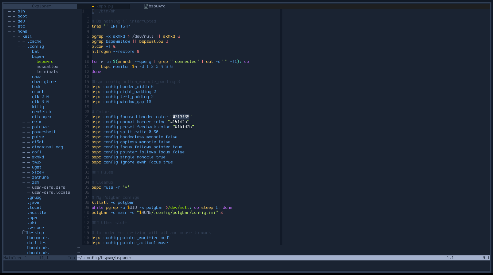

# HTB Neovim

This aims to be a port
[htb vscode theme](https://github.com/silofy/hackthebox) with support for
lua plugins, LSP and Treesitter for neovim 0.5.

## Installation

### Plug
```
Plug "WizardAlfredo/nvim-htb-lua"
```

### Packer

```
use "WizardAlfredo/nvim-htb-lua"
```

## Options
- **italics**
Enable italics for comments (default: enabled)

```lua
vim.g.htb_italics = 1
```

- **termtrans**
If you want to keep the transparency in your terminal (default: disabled)

```lua
-- To enable transparency
if vim.fn.has('gui_running') == 0 then
    vim.g.htb_termtrans = 0
else
    vim.g.htb_termtrans = 1
end
```

## Variants

- **htb**

The normal solarized scheme.  
`vim.cmd('colorscheme htb')`

## Screenshots



## TODO

- Plugins :-  
   - [ ] LSP  
   - [x] Treesitter  
   - [ ] Telescope  
   - [ ] FZF  
   - [ ] lualine  
   - [ ] lspsaga

# NOTE
- Thanks for ishan9299's vim-solarized-lua for providing most of the highlights
  and color codes for this scheme.
- If you have an issue with the highlight groups in theme open an issue but
  also mention the variant of the colorscheme you are using.
- If any more plugins are needed then open an issue.
